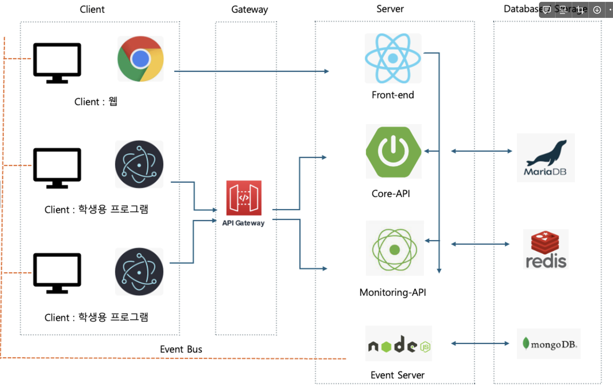

# DIDACTO

## IT 기반 교육의 질을 향상시키기 위한 실습환경 모니터링 및 원격제어 솔루션
### 상명대학교 휴먼지능정보공학과 졸업 프로젝트

## 팀원

| 역할 | 이름 | 담당       |
| ---- | ---- | ---------- |
| 팀장 | 소재휘 | Back-end  |
| 팀원 | 김태영 | Front-end |
| 팀원 | 안윤호 | Back-end  |
| 팀원 | 이원빈 | Back-end  |
| 팀원 | 이지민 | Front-end |

  

## 저장소
-  [Core Service 서버 Repository](https://github.com/graProj/didacto-api)
-  [Event Service 서버 Repository](https://github.com/graProj/didacto-event-service)
-  [학생용 응용 프로그램 프론트엔드 Repository](https://github.com/graProj/FE-STU)
-  [교수자용 웹 프론트엔드 Repository](https://github.com/graProj/FE-PRO-NEW)

  

# 목차
1. [문제 정의](#문제-정의)
2. [주제 구체화](#주제-구체화)
3. [사용 스택](#사용-스택)
4. [시스템 아키텍쳐](#시스템-아키텍쳐)
5. [유저 플로우와 ER 다이어그램](#유저-플로우와-er-다이어그램)
5. [주요 이슈와 해결](#주요-이슈와-해결)
6. [구현 내용](#구현-내용)
7. [구현 내용](#구현-내용)
  

# 문제 정의

4차 산업 시대를 맞아, 초등 교육기관부터 고등 교육기관까지 아울러 컴퓨터를 활용한 실습 수업이 점점 확대되는 추세이다. 그러나 여기서 발생할 수 있는 문제점들이 몇몇 있다.

- **교강사의 시간 관리 및 수업 효율성**: 교강사는 질문이 들어오면 자리로 가서 하나하나 봐주는 모습은 흔히 볼 수 있다. 해당 과정이 축적되면 시간소모, 진도도 제대로 못나가고 양질의 교육을 받을 수 없다.
- **학생들의 학습 환경 및 행동 관리**: 부정행위나 수업 시간 중 컴퓨터를 사용하여 수업 외적인 행위를 하는 등 학생들의 통제의 어려움
- **실습환경의 운영 및 관리**: 교육기관은 양질의 교육을 위해 실습환경을 제공할 책임이 있으나, 실습환경의 운영 및 관리가 미흡한 경우가 있음.

점점 확대되는 컴퓨터 실습 기반의 교육 환경에서 학생들의 양질의 교육을 보장할 수 있도록 실습 인프라를 개선할 수 있는 SW 솔루션을 개발하자.

  

# 주제 구체화

**1. 화면 공유**

교수자가 학생 참여자중 한 명을 선택시(모니터링 특정 학생 화면클릭) 지목한 학생 사용자와 1대1로 P2P가 이루어지는 서비스

- 서로 교환하는 미디어는 [교수자 : 음성, 카메라(얼굴)], [학생 : 컴퓨터 스크린]
- 교수자가 생성한 방에 들어와있는 학생 참여자중 교수자가 선택한 해당 학생 사용자와 교수자가 1대 1로 음성 및 화면을 공유할 수 있다.
- 이때 학생은 교수자의 캠 화면과 음성을 들을 수 있으며, 교수자는 학생의 모니터 화면 및 음성을 들을 수 있다.

**2. 원격 데스크톱**

교수자가 학생 사용자의 컴퓨터에 접근하여 직접 코드 수정 및 일정 액션을 취할 수 있는 서비스

- 교수자가 학생 사용자의 컴퓨터에 접근하여 특정 액션을 취할 수 있다.(마우스 클릭, 키보드 클릭)

**3. 모니터링**

교수자가 학생 참여자들의 스크린을 실시간으로 1:N 으로 모니터링 할 수 있는 서비스

- 학생 사용자가 응용 프로그램 초기 실행시 학생 사용자의 카메라, 음성, 모니터 화면의 접근 여부 권한 허용 상태가 된다.
- 그 후 교수자가 생성한 강의실에 들어가면 교수자는 학생 사용자의 모니터를 볼 수 있다.  (교수 1 : 학생 N)

  

# 사용 기술
<b>Backend : </b>
  
 
  
  
  
    

<b>Frontend : </b>
  
  
  
   
  

<b>DevOps & Deploy : </b>
   
  
   

  

# 시스템 아키텍쳐

1. **학생용 응용 프로그램** : 각 학생들은 실습 컴퓨터에 클라이언트 프로그램을 설치하여 실행할 경우 상호작용이 가능해진다. 해당 응용 프로그램은 Electron을 사용하여 빌드한다.
    1. Electron은 웹 표준 기술(HTML/Javascript)를 기반으로 멀티 플랫폼 환경의 응용 프로그램으로 빌드가 가능하게 하는 기술이다. 따라서 개발 생산성과 상이한 OS 환경에서의 지원을 목표로 하여 채택하였다.
2. **Front-end Server**  : 사용자들의 회원 기능, 강의실 생성 및 참여 등 기본적인 기능을 수행하고, 교수자의 학생 모니터링 및 P2P, 원격 데스크탑을 수행할 수 있도록 UI를 제공한다. 
3. **API** : 필요한 API를 제공하는 서버를 구성한다. 더 나아가서 서비스를 분리하여 서버를 구성할 수 있는지에 대한 검토를 수행중이다.
    1. **Core Service** : 인증, 사용자 식별, 강의실 생성 및 참여 등 기본적인 기능 수행
    2. **Monitoring Service** : 응용 프로그램으로부터 주기적으로 스크린 화면 및 접속시간을 Push받고, 웹 페이지에게 지속적으로 해당 모니터링 리스트를 Polling하도록 비동기 동작에 특화된 API를 구축한다. Message Queue를 사용하여 트래픽 페이스를 조절한다.
    3. **Event Service** : P2P 통신을 시작할 때 필요한 시그널링 서버(Signaling Server)의 역할을 하면서 원격 데스크톱을 구현하기 위한 이벤트 중심 프로그래밍을 하기 위한 서버이다.

  

# 유저 플로우와 ER 다이어그램

  

# 주요 이슈와 해결

### 협업 환경 구축하기
프로젝트를 할 때 언제나 함께 진행할 수는 없기 때문에 협업 시 규칙 및 환경을 통합시키는 것이 중요하다.
1. 데이터베이스와 같은 개발 환경을 세팅할 때 도커 컨테이너 기반으로 세팅하였다. 이를 통해  같이 작업하는 동료들이 통일된 환경에서의 개발을 진행할 수 있도록 하였다.
2. AWS와 Docker를 사용하여 간단한 구조의 데브서버를 구축한다. 
3. 데브서버에서 데이터베이스나 P2P의 상태를 확인할 수 있도록 추가적인 UI와 모니터링을 위한 관리자 페이지를 추가해주었다.
4. 백엔드 개발자들 간에 프로젝트의 인터페이스 작성 규칙, 계층 구조, 테스크 코드 작성 등을 사전에 협의하여 유지보수성을 높이려고 하였다.
5. 형상 관리는 Git의 브랜치 규칙과 커밋 규칙을 세우고, 이슈 단위로 분업하여 진행, PR에 따른 코드 리뷰의 프로세스를 따르도록 협의하였다.

 
 

### 효율적인 API 인터페이스 제공
API를 개발할 때에 프론트엔드 개발자들에게 효과적인 인터페이스를 제공하여 연동을 순탄하게 진행할 수 있도록 도와야 했다.
1. Swagger를 사용하여 API 문서 자동화
- 요청과 응답 파라미터에 대한 설명을 꼼꼼하게 추가하고, Example를 함께 추가해주어 Swagger Docs에서 간편하게 실험할 수 있도록 한다.
2. 응답 형식의 통일
- 응답의 형식을 백엔드 개발자들 간에 협의하여 통일시켰으며 동일한 모델을 사용한다.
- 예외처리의 경우 커스텀 핸들러를 추가하여 사용자가 예외에 대한 응답 코드, 메시지, HTTP 코드 등을 확인할 수 있도록 하였다.

 
 

### P2P 연결과 원격 데스크탑
상대적으로 생소한 P2P 연결과 원격 데스크탑을 구현하기 위해서 많은 리서치를 하였으며, 구현된 내용은 다음과 같다.
1. 시그널링 서버로는 원래 서비스와 별도로 가볍고 빠르게 만들 수 있는 Express 기반 서버를 채택하였다.
2. STUN 서버로는 Google에서 제공해주는 서버를 활용하였다.
3. 시그널링 교환을 위해서 다양한 전송 프로토콜을 지원하는 Socket.io를 사용하여 기본적인 Websocket보다 안정적인 통신이 가능하게 하였다.
4. 연동 테스트를 하기 위해서 Socket.io의 연결을 감시하는 Admin page를 데브서버에 추가하여 모니터링을 진행하였다.

 
 

### Connection의 제어

P2P 연결을 할 때, Websocket을 사용하여 시그널링 역할을 한다. 그런데 접속은 반드시 교수자와 학생이 1명씩만 매칭되어야 한다는 규칙이 있었다. 규칙은 다음과 같다.

- 교수자는 학생이 접속하지 않은 Room에는 접근 불가능 (학생의 화면이 없으므로 감시할 필요도 없음)
- 교수자는 학생의 연결이 끊어지면 함께 연결이 끊어짐
- 학생이 계정으로 A Room에 접속 도중, 또다른 컴퓨터로 같은 A Room에 접속할 때 기존 A Room에 접속중이던 컴퓨터는 강제 접속 종료가 되어야 한다.
- 교수자도 마찬가지로 브라우저에서 A Room에 접속 도중, 또다른 브라우저에서 같은 A Room에 접속할 때 기존 A Room에 접속중이던 브라우저는 강제로 접속 종료되어야 한다.
- 이상적인 P2P는 A 접속자끼리 1:1 통신, B 접속자끼리 1:1 통신을 하여야 한다.

 

따라서 이를 제어하기 위해서 Redis를 사용하여 커스텀 락을 구현하였다.
Redis를 이용한 커스텀 락은 여러 클라이언트가 동시에 특정 자원에 접근하지 못하도록 제어하는데 매우 유용하다.
1. 락 획득 
학생이나 교수자가 Room에 접속하려고 할 때, 먼저 Redis에서 해당 Room에 대한 락을 획득한다.
만약 이미 락이 존재하면 다른 사용자가 접속 중임을 의미하므로, 새로운 접속 시도를 거부하거나 기존 접속을 종료한다.
2. 락 해제 
학생이나 교수자가 Room에서 나가면 Redis에서 락을 해제하여 다른 사용자가 Room에 접속할 수 있도록 합니다.
3. 자동 해제 
만약 클라이언트가 비정상적으로 종료되거나 연결이 끊어졌을 경우를 대비하여 Disconnection에 대한 이벤트 처리와 락에 TTL을 설정하여 자동으로 해제되도록 설정한다.

  

# 구현 내용
P2P 스트리밍과 원격 제어는 1차 개발 범위에 포함되어 완성. 
추가 개발로 모니터링 기능을 2024년 6월부터 개발 진행

## P2P 스트리밍

교수자가 학생과 1:1로 미디어를 실시간으로 교환하기 위해서 **Web RTC** 기술을 사용한다.

- WebRTC(Web Real-Time Communication)는 웹 브라우저 간에 실시간으로 음성, 영상 및 데이터 통신을 가능하게 하는 오픈 소스.
- **Google Meet, Zoom, Facebook Messenger 등 실시간 미디어 스트리밍이 사용되는 어플리케이션**에서 많이 사용
- 초기 연결에 성공한 이후에는 P2P Connection을 통해 데이터를 주고받는다는 특징

**Web RTC의 주요 구성 요소와 구현 계획**

- STUN 서버 : **클라이언트들이 서로에게 직접 연결이 가능하도록 외부에서 접근 가능한 주소와 방법을 알려주는 역할.** 클라이언트는 STUN 서버에게 자신의 Public IP 주소 및 포트를 요청하고, 이 정보를 상대 Peer와 공유한다.
    - **STUN 서버로는 Google에서 제공하는 STUN 서버를 사용**
- **시그널링 서버 :** **통신 시작을 위한 연결 정보를 교환하는 중계 서버의 역할.** 클라이언트들이 서로의 주소를 알아내고 통신을 시작하기 위해서는 시그널링 서버가 필요하다. 클라이언트들 간의 연결 메타데이터 및 통신을 위한 제어 메시지를 전달해준다.
    - **시그널링 서버가 필요하므로 문서 상단에서 설명했던 Event Server를 구축하여 서로의 Connection 정보를 교환하도록 중개할 수 있도록 시스템을 구축**할 것이다.

  

## 원격 제어 플로우

1. Event Sever에는 <강의 - 학생>의 고유한 그룹이 존재하며, 해당 그룹 내에 있는 클라이언트끼리의 이벤트 Subscribe와 Publish가 이루어진다.
2. **P2P 연결 진행 상황** : 해당 고유한 그룹에 교수자와 학생이 Join한 상황이다.
3. P2P 연결이 진행 중일 때 교수자의 이벤트에 의해서 원격 제어가 이루어진다.
4. **원격 데스크탑의 작동 방식은 위의 차트와 같이 아래의 과정을 따른다.**
    1. 교수자의 이벤트 발생(마우스 Up/Down, 키보드 Up/Down 등) 시 Event 서버로 Publish한다.
    2. 해당 이벤트를 Listen하고 있던 학생이 Message를 Subscribe한다.
    3. 학생의 응용 프로그램은 해당 메시지를 바탕으로 OS에 I/O 이벤트를 발생시킨다.

  
### P2P 연결되어 원격 제어가 진행중인 화면

  

## 모니터링

추가 개발 범위로서 포함됨. 2024년 6월부터 개발 진행
1. 학생 : Application에서 주기적으로 화면을 TCP로 서버에 전달
2. 서버 : 전달받은 이미지를 Message Queue에 적재, 이를 Client에게 주기적으로 전달 이벤트 발생
    - Redis와 같은 인메모리 저장도 대안
3. 교수 : SSE를 연동시켜 서버측에서 주기적으로 발생하는 이벤트(이미지 리스트 전송)을 받아서 갱신하기
  

 
 

  

