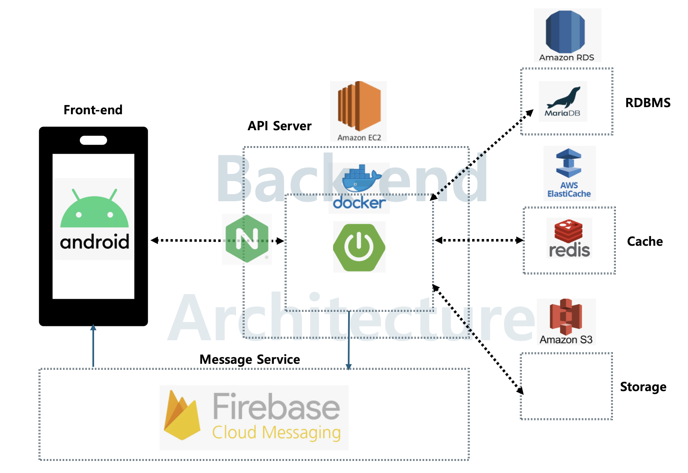

# WISEFEE

## 자체 텀블러를 활용한 커피 정기구독 비즈니스 모델

**BM 활동시기** : 2023.05.04~2024.01.06   
**팀원** : 강동현, 고민영, 김보현, 김인선, 김주은, 김진호, 소재휘, 시승연, 윤수빈

**소셜 미션**  : 카페에서 무분별하게 사용되는 일회용 컵 폐기물을 줄이고자 텀블러 대여 서비스를 개발함.   
   
**솔루션** : 카페 이용자와 가까운 카페 간에 텀블러 정기구독 서비스를 구축하여 다회용품 사용률을 높일 수 있도록 유도함.
(회사원, 학생 등 주기적으로 카페 이용을 하는 소비자를 타겟으로 설정)   

    

## Stack
<b>Backend : </b>
  
 
  
  

<b>Frontend : </b>
  
  

<b>DevOps & Deploy : </b>
   
  
   
           

  

## 시스템 아키텍쳐

  

## 기여 내용

### 비즈니스 모델
1. 개발과 더불어 비즈니스 모델의 기획 및 검증의 전반적인 프로세스에 비중있게 기여함.
2. 아이디어톤 당시 수익 구조 아이디어의 제안
3. 비즈니스 모델의 데스크 리서치 및 필드 리서치 과정 참여
6. 솔루션 알파 테스트 시행 프로세스 주관
7. 총무로서 SK측의 지원금으로 클라우드를 비롯한 개발 비용을 계산하고 산출함.

### 백엔드 개발
1. 팀 내의 백엔드 개발 파트장으로 타 파트 팀장들과 의사소통 및 팀원들에게 역할 분배
2. 백엔드 부서 내 스터디 및 주기적인 스프린트 주관
3. 주요 개발 업무 : 프로젝트 초기 세팅, Security, 고객과 매장의 연결 부분의 비즈니스 로직 개발, 테스트 서버 및 운영 서버 배포
   
   

## 비즈니스 모델

### 도식

## 개요

## 서비스 유형

## 실행 화면

  

## 알파 테스트 실행
캠퍼스 내, 간이 부스를 설치 하여 2일간 와이즈피 비즈니스 모델 프로세스에 따라 텀블러를 대여해주고 반납을 받는 부스를 운영   
   

## 사용 영상 
   

## 저장소
[Repository](https://github.com/WISEFEE/SKLookie_SMU_Wisefee_Server)

